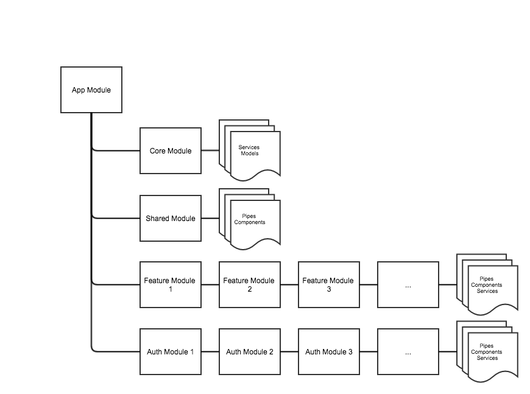
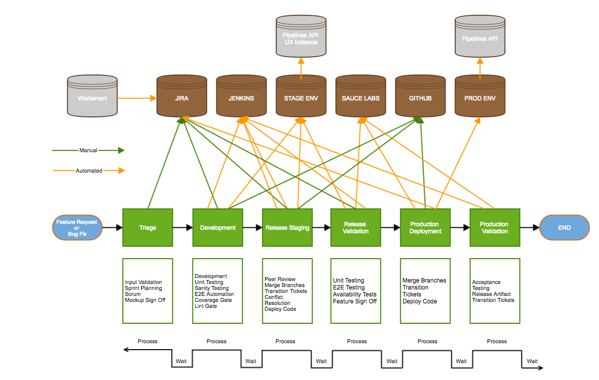

# Pipelines UI Docs

1. [Problem Statement](#problem-statement)
2. [Rationale](#rationale)
3. [Technology Stack](#technology-stack)
4. [Value Stream Map](#value-stream-map)
5. [Performance Metrics](#performance-metrics)
6. [Technical Requirements](#technical-requirements)

## Quick Links

- [Development Process](development-process.md)
- [Home](../)
- [API Proxy](api-proxy.md)
- [Runbooks](runbook.md)
- [Integration Testing](integration-testing.md)


## Problem Statement

### Who is your audience? 

- Digital decision maker (technical user and decision maker)
- Uses Acquia Cloud to develop and deploy their digital experiences

### Why do you need a UI?

- Monitor and investigate their build jobs in a place that is centrally located
- Setting up continuous integration/deployment/delivery/deployment in a way that is integrated with Acquia Platform and consistent with other behaviours such as setting up database, deploying code, setting up environments, etc

### What do need and want to do?

- Set up automation
- They to need to build/compile their code
- They need to debug their builds 
- They need to test and deploy their code

### How does the UI solve the problem?

- Unified UI including a common IA
- The UI utilizes a framework that has high performance in relation to real-time large datasets
- The UI provides deep linking to very large build logs
- The UI provides real time monitoring and custom reporting of jobs
- The UI provides a workflow for setup and integration with Github and other repositories
- The UI implementation will be much faster with Angular 2 than Angular 1 regarding loading, rendering and large data sets
- The UI implementation will need to be maintained with UI resources allocated to the Pipelines team

## Rationale

The Pipelines UI team is an embeddable window afforded in the current cloud application, which will serve the Pipelines UI Application. This allows full separation of development processes between the N3UI Team and the Pipelines Team. The application is built on “Angular” (2+), served from pipelines.acquia.com, and utilizes Acquia Cloud for hosting. It can also live as a standalone application in the future.

### N3UI Integration

1. When viewing an application on cloud, there should be a sidenav link called “Pipelines” in which a user can click.
2. When clicking the “Pipelines” sidenav item, it reveals an IFrame that takes up 100%x100% space of the content area, responsively.
3. The N3UI Should have the following Routing to show this pipelines content area: 
  - `/app/develop/applications/[appUuid]/pipelines/jobs`
  - `/app/develop/applications/[appUuid]/pipelines/jobs/[jobId]`
4. The N3UI Routing then provides the route parameters to the iframe in the following format
  - `domain.com/application/landing/[appUuid]`
  - `domain.com/application/jobs/[appUuid]/[jobId]`
5. The N3UI Activity stream should provide a deep link to a pipeline job’s logs using the second specified iframe url in #3

## Technology Stack

### Front End Framework

Angular 2. This includes Google’s owned and maintained Angular toolchain, angular-cli.  Each module has it's own README file in which it describes the modules's architecture, feature list, and test strategy.



#### Application Items

##### App Module

The first module to load, contains the root level routing of the application, and the bootstrapping logic. Handles first loads of the application and provides the base interface, such as navigation components, or the embedded components in N3UI

##### Core Module

A module that contains global logic for all components, and is bundled with the App Module on first load. Contains global services, model definitions, and any entry components needed for the application

##### Shared Module

A module that can be imported into feature and auth modules to provide common components, pipes, that are not necessarily global. This is only loaded when it is needed, and not bundled with any other module.

##### Feature Modules

A module that contains all assets and view logic for a Pipelines UX feature, such as JobLists, or designing pipeline definitions. These are bundled separately and are self containing modules from other features. They often include their own inner routing, for example /jobs to list jobs, and /jobs/:job-id to display a single job in detail.
- jobs // view pipeline jobs related to an app
  - Job Detail Component // view an individual job 
- landing // first view to determine where to go, and what to see based on user subscription and entitlements
- …. // extensible

##### Auth Modules

A subset of feature modules, specifically named to provide a user flow to authenticating into pipelines UX, or authenticate a SCM with pipelines itself, such as github -> pipelines
- auth-github  // Integrate Pipelines and Github in new application
- auth-tokens // Use Pipelines with existing N3 Tokens/Applications
- auth-bitbucket // Integrate Pipelines and Bitbucket in a new application
- auth-acquia // Integrate Pipelines with Acquia Git in a new application
- …. // extensible

#### Side Features

- [Ahead of Time Compilation](https://angular.io/docs/ts/latest/cookbook/aot-compiler.html) for Load/Render Speed, Better Injection Security 
- [Lazy Loading of Module for Load Speed](https://angular-2-training-book.rangle.io/handout/modules/lazy-loading-module.html) 
- [GZIP For Load Speed](https://varvy.com/pagespeed/enable-compression.html) 
- [Web Animation](https://developer.mozilla.org/en-US/docs/Web/API/Web_Animations_API) / [Angular 2 API](https://angular.io/docs/ts/latest/guide/animations.html) for Advance UX Interaction animation 
- [Module Based Architecture](https://en.wikipedia.org/wiki/Modular_programming) including [D.R.Y.](https://en.wikipedia.org/wiki/Don%27t_repeat_yourself) and [MVVM](https://msdn.microsoft.com/en-us/library/hh848246.aspx) 
- [Dependency Injection](https://martinfowler.com/articles/injection.html) Baked into the Framework 
[SASS](http://sass-lang.com/) for [branding](https://confluence.acquia.com/pages/viewpage.action?pageId=15303536) (and a style wrapper around Google’s [material design components](https://github.com/angular/material2))

#### Why Angular (2+) vs Angular 1

1. Totally revamped data binding system to allow top performance for large datasets and consistently changing UI data such as large log streaming and customer build reporting 
2. Support for varying view encapsulation strategies to maximize data binding and UI performance on large amounts of bound elements 
3. Built in support for Observables, which are utilized for streaming live data (Websockets for example) 
4. 100% usage of the Shadow DOM negating cross cutting concerns in styling and UI behavior components. 
5. Usage of DOM caching for large datasets represents a [huge speed benefit](https://auth0.com/blog/more-benchmarks-virtual-dom-vs-angular-12-vs-mithril-js-vs-the-rest/) vs Angular 1. 
6. Clear migration and support path following best practices such as consistent semver 
7. Microsoft/Google backed Tool chain support featuring minification, obscurification, gzipping, babel support, and stage aware builds of the application 
8. TypeScript for less dynamically introduced bugs (better enterprise usages and dev flow). 
9. New Module System means this application can easily embed into future Angular apps 
10. The built in animation engine in “Angular” allows consistent sharable interaction and behavior UX elements to be designed and shared. 
11. Ahead of Time Compilation to handle large initial file footprints, and server side rendering available for even better initial load times. 
12. Support for Lazy Loading, whereas angular 1 has no built in support for lazy loading of modules, which results in reduction of initial loads. 
13. Intuitive template syntax language for complex UI views and view flows. 
14. Easier open source library generation/inclusion with zones vs the Angular 1 digest cycle 
  

### Authentication Architecture

One of the primary unresolved issues with implementing a separate UI application using the N3 API is authentication. N3 API is the source of truth for users and authentication for Cloud UI, and we want to preserve it as the source of truth for all Acquia applications. We also want to preserve single sign-on across all Acquia applications.

The Pipelines UI will make API calls to the Pipelines API. The Pipelines API has no native user authentication system; it delegates user authentication and authorization to the N3 API. Currently, the Pipelines CLI delivers the user's N3 credentials to the Pipelines API on every call, and Pipelines API calls the N3 API to validate them and authorize the user. In order to replicate this CLI model, the Pipelines UI will need a way to provide the user's N3 credentials to the Pipelines API just like the Pipelines CLI does.

For credentials, N3 API defines "tokens," consisting of a key and secret, and uses an HMAC-based authentication scheme for validating API requests. Customers generate and retrieve these tokens via the Cloud UI. However, the N3 API and Cloud UI provides no intentional mechanism for sharing these credentials with other Acquia applications so that those applications can both authenticate/authorize users against N3 and make N3 API calls on behalf of users. There is no provided way for the Pipelines UI to acquire N3 tokens to delivere to the Pipelines API as the Pipelines CLI does.

It turns out, however, the Cloud UI does not use N3 API tokens itself. Instead, the Cloud UI delivers normal Drupal session cookies for all N3 API requests, and the N3 API accepts and validates those cookies in addition to accepting and validating N3 API tokens. The user acquires Drupal session cookies for Cloud UI, hosted at cloud.acquia.com, via the Bakery single sign-on system used by accounts.acquia.com, cloud.acquia.com, and other sites.

Bakery works by having a single domain-wide cookie, called the "chocolate chip cookie" (I'm not making this up), associated with the domain name .acquia.com. When this chocolate chip cookie is delivered to a site participating in the Bakery system, the site is able to use it to authenticate the user, create a local account if appropriate, and log the user in.

The Bakery chocolate chip cookie provides exactly the N3 credential that the Pipelines UI needs to pass to the Pipelines API. Because the Pipelines API is hosted within the .acquia.com domain, when the Pipelines UI makes a Pipelines API call, the Bakery chocolate chip cookie will be delivered. Pipelines API can then use this cookie to impersonate the user in a call to cloud.acquia.com, and thus perform the same authentication and authorization that Pipelines API already does using the N3 tokens passed by the Pipelines CLI.

We validated this approach will work by using curl with a CHOCOLATECHIPSSL cookie to get a Cloud API session cookie, then delivering both cookies plus ACQSESSEXP=1:

  
```bash
curl -D - -b 'CHOCOLATECHIPSSL=NzYzNj...; ACQSESSEXP=1; SSESS57caad94ce75732474b79bdaf223899e=AGLBE4C...' [https://cloud.acquia.com/api/applications](https://cloud.acquia.com/api/applications)

HTTP/1.1 200 OK

Server: nginx

Date: Fri, 27 Jan 2017 16:32:36 GMT

Content-Type: application/json+hal

Transfer-Encoding: chunked

Connection: keep-alive

Set-Cookie: ACQSESSEXP_PUB=1; expires=Fri, 27-Jan-2017 18:02:35 GMT; Max-Age=5400; path=/; domain=.acquia.com

Set-Cookie: ACQSESSEXP=1; expires=Fri, 27-Jan-2017 18:02:35 GMT; Max-Age=5400; path=/; domain=.acquia.com; secure; httponly

Expires: Sun, 19 Nov 1978 05:00:00 GMT

Cache-Control: no-cache, must-revalidate

X-Content-Type-Options: nosniff

X-Request-Id: 0901f12e-a524-4cbf-882e-df9b00650dcc

X-Request-ID: 0901f12e-a524-4cbf-882e-df9b00650dcc

X-AH-Environment: prod

  

{

    "total": 10,

    "_links": {

        "self": {

            "href": "https:\/\/cloud.acquia.com\/api\/applications"

        }, 
```


Due to the authentication architecture described above, the Pipelines UI requires a backend service that is accessible at a domain name in the acquia.com zone, which will receive the Bakery chocolate chip cookie from the web browser and can then authenticate/authorize the user against the N3 API.

The Pipelines UI will then make various Pipelines API calls in order to retrieve the data to populate the UI. These Pipelines API calls are what actually needs to perform authentication and authorization against the N3 API. From this, it follows that the Pipelines UI back end service must in fact the Pipelines API service itself. The Pipelines API will be accessible via the the api.pipelines.acquia.com domain name, which will be created as a CNAME to the existing Pipelines API production domain name (pipeline-api-production.pipeline.services.acquia.io).

The complete web request flow, starting from a user logged into Cloud API, is as follows:

- The user clicks on the Pipelines link associated with a specific Cloud application. That link points to a page on Cloud UI whose main body consists of an IFRAME tag which loads the Pipelines UI. The URL is something like https://pipelines.acquia.com/?app=APP_UUID&cloudui=1.  The APP_UUID parameter specifies the Cloud Application ID for the current page, and cloudui=1 parameter says that this instance of the application will be embedded in the Cloud UI (in case we decide to have different behavior for a non-embedded version). 
- The IFRAME loads the static HTML, CSS, and JavaScript for the Pipelines UI Angular 2 application. 
- The Pipelines UI calls a Pipelines API /auth/bakery/APP_UUID endpoint to establish authentication credentials. 
- Pipelines API needs to authenticate and authorize the calling user. It performs the following steps: 
    - Because the Pipelines API is accessed at api.pipelines.acquia.com, the Bakery chocolate chip cookie associated with the .acquia.com domain name is delivered along with the API request. The Bakery cookie identifies the calling user based on Acquia’s SSO scheme for *.acquia.com sites. 
    - Pipelines API makes an HTTP GET request to https://cloud.acquia.com/api/, delivering the Bakery chocolate chip cookie it received from the UI. If the cookie is valid, it receives a response containing two session cookies, one marked secure and one not. This indicates that the user is authenticated. 
    - Pipelines API makes a second HTTP GET request to the “list-jobs” N3 API endpoint for APP_UUID, passing the Bakery cookie, secure session cookie (both are required), and also a ACQSESSEXP=1 cookie which cloud.acquia.com requires. 
    - The list-jobs call simultaneously checks that the user has “Execute Pipelines” permission on APP_UUID and that APP_UUID is entitled to use the Pipelines product. If it returns HTTP status 200, the user/API call is authenticated and authorized. 
    - Pipelines API delivers the cloud.acquia.com session cookie back to the UI, but with the domain set to .pipelines.acquia.com and with the same expiration and HttpOnly; this is called the “Pipelines API session cookie” to distinguish its different domain name from the Cloud session cookie. It also delivers an ACQSESSEXP=1 cookie, semantics to be determined. 

- On subsequent calls to Pipelines API by the Pipelines UI, the browser automatically delivers the Bakery, Pipelines API session, and ACQSESSEXP cookies to Pipelines API. On each call, Pipelines API uses the N3 API list-jobs endpoint in a single round-trip to authenticate and authorize the user, as it already does for CLI and web hook callers. 
    - If desired, Pipelines API could also create its own session store, caching the fact that the Pipelines API session cookie is authorized to access APP_UUID. If the user logged out from Cloud UI, the Bakery cookie would be deleted from the browser so it would not be provided to Pipelines API, and Pipelines API would therefore know that the session cookie is no longer valid. So far, this optimization has not been necessary for the Pipelines CLI, but if the Pipelines UI polls the Pipelines API for job status information, it might become more important. 
    - NOTE: Up to this point, this design does not require Pipelines API to be an official Bakery slave with a copy of the Bakery shared secret. However, if Pipelines API caches session keys as described in this paragraph, a user that logged out of Cloud UI could still perform Pipelines operations by providing an invalid Bakery cookie, since Pipelines API is not able to validate the Bakery cookie without a copy of the Bakery shared secret. 
    - So, if the authentication/authorization load from Pipelines API to N3 API becomes a problem, Pipelines API will need to have a copy of the Bakery shared secret in order to reduce the load. 
  
The approach above allows the Pipelines UI to make API calls to the Pipelines API while using the N3 API for user authentication and authorization. However, it does not provide a solution for Pipelines API to respond to requests from third-party systems, such as GitHub web hooks, for which there is no browser to deliver a Bakery cookie. To solve that, Pipelines API can allocate its own N3 tokens when needed. For example:

- When a user completes the GitHub initialization process via the UI, the Pipelines UI will make a connect-github call to Pipelines API. This API call will be authenticated and authorized as described above, so Pipelines API at that moment will have credentials to make N3 API calls on behalf of the user. 
- Pipelines API creates a new set of N3 tokens for the user via the [http://acquia.github.io/network-n3/#account_tokens_post](http://acquia.github.io/network-n3/#account_tokens_post) endpoint. It stores these tokens in the same place it already stores tokens provided during the GitHub initialization process via the CLI. 
- Pipelines API uses these N3 tokens when calling the N3 API in response to GitHub web hooks.

### Hosting Environments

From a hosting perspective, the Pipelines UI will be a purely static website: HTML, CSS, and JavaScript. Any hosting infrastructure is capable of serving it. Scalability is not a concern. 

The Pipelines UI will be served from a domain name within acquia.com, such as pipelines.acquia.com/app. The Pipelines API application will list this domain name as (one of) the allowed domain names for cross-domain JavaScript requests.

#### Acquia Cloud Hosting

- Enables, but does not require, using Pipelines as the CI/CD service for Pipelines UI. If/when we choose to use Pipelines for this, benefits include: 
    - Daily usage of the Pipelines UI by the development team, which will result in fast bug fixes and insight into desirable features. 
    - Validation that Pipelines is sufficient for providing CI/CD for front-end applications, or explicit awareness of why it is not. 
    - On-demand environments for every feature branch and pull request. 
- Proof point for development of "decoupled Drupal" applications on Cloud. 

### QA Considerations

End to end, Acceptance, Regression, and integrations would follow the same strategy and technology that is currently implemented as the cloud UX (homegrown “aqtest”, selenium, Sauce Labs, etc) with the addition of a node.js based API testing framework.

Unit Testing Frameworks uses existing industry standard Karma, which is also aligned with N3UI’s unit test strategy.

Unit Test Coverage should be calculated with Istanbul and should be reported out to Jenkins/pipelines, but can also be reported to Coveralls for an enterprise wide view.

## Value Stream Map



[Link to Full View](assets/vsm.png)
