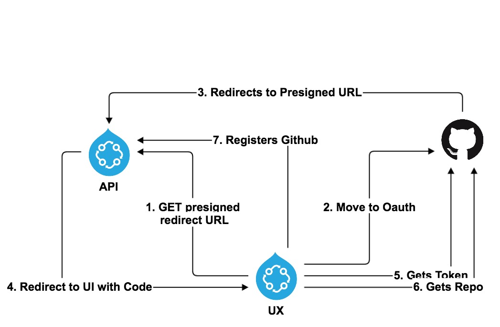

# Pipelines UI API Proxy

To handle the Github OAuth integration API flow, the UI needed to make a non CORS post to github. To circumvent this limitation, a [proxy php script](../server/api/cors-proxy.php) was created to simulate a non CORS request.

Github on it's login/oauth/access_token prevents CORS requests from validating using the usual browser preflight OPTIONS request. It therefore will reject any AJAX/XHR request to that endpoint from the browser, regardless of where it comes from.

This approach is temporary.  In MS-2326, the Pipelines API will handle and store the required Github Access token, and proxy all github interaction after the user Authenticates on github itself. This will enhance the security surrounding the access token and replace the need to proxy this request.

To remove this temporary solution, change the src/core/services/oauth.service.ts `fetchAccessToken` method to send the POST of the code and state directly to the new endpoints described in the aforementioned ticket.

## How it works

1. Instead making an http request from the UI code directly to github, you make it to:
```
/server/api/cors-proxy.php
```

2. The call you make to this endpoint should be exactly the call you want to make to github with the following header:
```
X-Proxy-Url: https://github.com/login/oauth/access_token
```
  
3. Note: The url you use can be switched out for any URL. This initial implementation was only needed for the above mentioned in the overall github flow (specifically, number 5):
  

  
  
